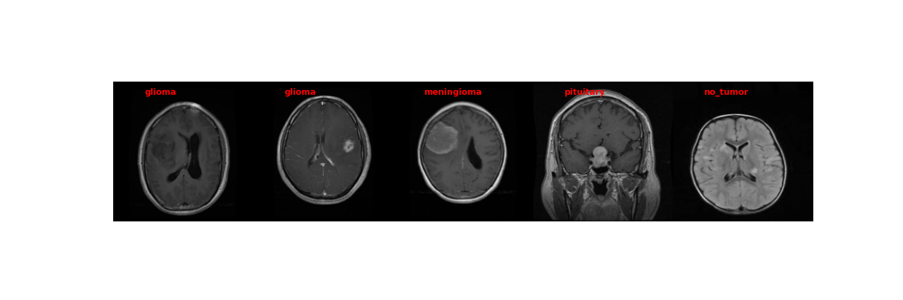

# BRISC 2025 Brain Tumor Project

This repository contains a deep learning project using the BRISC 2025 MRI classification dataset.

## Project Overview

The goal of this project is to classify MRI brain scans into different tumor categories using deep learning and PyTorch.

The dataset includes MRI scans from four classes:

- glioma
- meningioma
- pituitary
- no_tumor

This milestone focuses on building a working PyTorch data loader and demonstrating successful image loading and visualization.

## Dataset

Dataset source:

https://www.kaggle.com/datasets/briscdataset/brisc2025

Sample MRI images are included in this repository under:

```text
data/sample/train/

brisc2025-brain-tumor-project/

├── data/
│   └── sample/

├── notebooks/
│   └── data_demo.ipynb

├── src/
│   └── brisc_project/
│       ├── __init__.py
│       └── brisc.py

├── README.md
├── requirements.txt
└── pyproject.toml
```

notebooks/data_demo.ipynb

## Methods Overview

In progress.

Planned methods include:

CNN image classification
Grad-CAM visualization
Integrated Gradients
Score-CAM
Segmentation mask comparison

## Results

In progress.

## Conclusion

In progress.

## Installation

```bash
pip install -e .
```

## Package Usage
```python
import sys
sys.path.append("./src")

from brisc_project.brisc import get_data_loader

loader, classes = get_data_loader(
    "data/sample/train",
    batch_size=5
)
```

## Example MRI Batch



The BRISC 2025 dataset contains both classification and segmentation tasks for brain tumor MRI analysis. 

The classification portion of the dataset is used to train models to predict tumor categories including glioma, meningioma, pituitary tumor, and no tumor.

The segmentation portion includes ground-truth tumor masks that will later be used to evaluate explainability methods such as Grad-CAM, Integrated Gradients, and Score-CAM using Dice coefficient and Intersection over Union (IoU) metrics.

