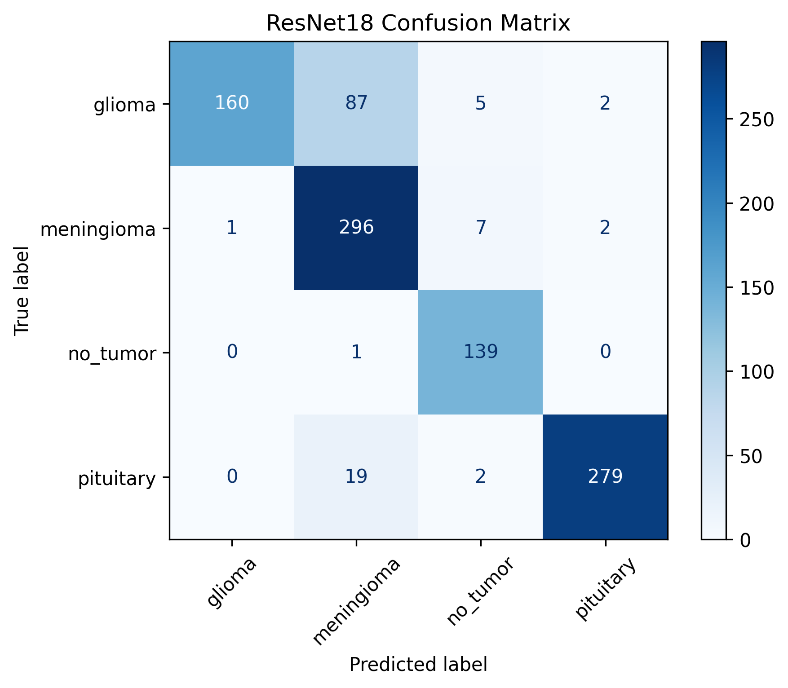

# Do Models Look Where It Matters? Brain Tumor MRI Classification and Interpretability

## Project Overview

This project investigates whether deep learning models can accurately classify brain tumors from MRI scans while also focusing on model interpretability. Although image classification models can achieve high accuracy, it is often unclear whether they are making predictions based on meaningful image regions. The goal of this project is to evaluate both classification performance and interpretability.

The project uses a ResNet18 convolutional neural network to classify MRI scans into four categories:

* Glioma
* Meningioma
* Pituitary Tumor
* No Tumor

Interpretability methods including Grad-CAM, Integrated Gradients, and Score-CAM were used to visualize the regions that contributed most strongly to model predictions.

## Dataset

This project uses the BRISC 2025 Brain Tumor MRI Dataset from Kaggle:

https://www.kaggle.com/datasets/briscdataset/brisc2025

The dataset contains:

* MRI classification images
* Four classification categories
* Ground-truth segmentation masks

The segmentation masks allow quantitative evaluation of interpretability methods.

### Dataset Structure

brain_tumor/brisc2025/classification_task/

brain_tumor/brisc2025/segmentation_task/

## Model

The project uses a pretrained ResNet18 model from torchvision.

Transfer learning was used by replacing the final fully connected layer with a new layer containing four output classes.

Model code can be found in:

src/brisc_project/models.py

## Training

Training code can be found in:

src/brisc_project/train_model.py

To train the model:

```bash
python src/brisc_project/train_model.py
```

## Results

### Classification Performance

Classification metrics were evaluated on the test dataset.

#### Classification Report

| Class | Precision | Recall | F1-Score |
|---------|---------:|---------:|---------:|
| Glioma | 0.99 | 0.63 | 0.77 |
| Meningioma | 0.73 | 0.97 | 0.83 |
| No Tumor | 0.91 | 0.99 | 0.95 |
| Pituitary | 0.99 | 0.93 | 0.96 |
| **Weighted Average** | **0.90** | **0.87** | **0.87** |

The model achieved an overall test accuracy of 87.4%. Performance was strongest for pituitary tumors and no-tumor images, with F1-scores of 0.96 and 0.95 respectively. Meningioma classification achieved high recall (0.97), while glioma classification was more challenging, resulting in a lower recall of 0.63. Overall, the model demonstrated strong classification performance across the four classes.

### Confusion Matrix



The confusion matrix shows that the model correctly classified most MRI scans across all four categories. Some misclassifications occurred between tumor classes, suggesting that certain tumor types share visual characteristics that make them more difficult to distinguish.

### Interpretability Evaluation

Interpretability methods were compared against the ground-truth tumor segmentation masks using:

* Dice Coefficient
* Intersection over Union (IoU)

#### Results

| Method    | Average Dice | Average IoU |
| --------- | -----------: | ----------: |
| Grad-CAM  |       0.1368 |      0.0792 |
| Score-CAM |       0.1276 |      0.0772 |

Grad-CAM achieved higher overlap scores than Score-CAM on the evaluated images. However, both methods produced relatively low Dice and IoU values, suggesting that strong classification performance does not necessarily imply precise localization of tumor regions.

## Visualizations

The repository includes:

* Example MRI predictions
* Confusion matrix visualizations
* Grad-CAM heatmaps
* Integrated Gradients attribution maps
* Score-CAM heatmaps

Examples can be found in:

notebooks/evaluation.ipynb

## Limitations

Several limitations should be noted:

* Only a single architecture (ResNet18) was evaluated.
* Interpretability methods were evaluated on 50 correctly classified tumor images.
* Dice and IoU results are sensitive to threshold selection.
* Heatmap explanations provide approximate localization rather than precise tumor boundaries.
* Results are limited to the BRISC 2025 dataset.

## Repository Structure

src/brisc_project/

* brisc.py
* models.py
* train_model.py

notebooks/

* data_demo.ipynb
* model_baseline.ipynb
* interpretability_demo.ipynb
* evaluation.ipynb

models/

* resnet18_brain_tumor.pth

## Model Weights

Trained model weights:

models/resnet18_brain_tumor.pth

## Author

Calvin Cai

University of Oregon

